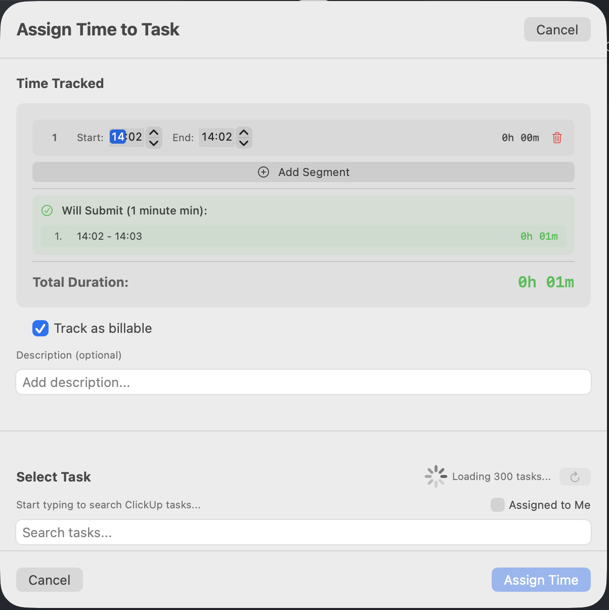

# ClickUpTracker

 

A native macOS menu bar application for intelligent time tracking with ClickUp integration. Built with Swift and SwiftUI.

> **Note:** The prebuilt `ClickUpTracker.app` in this repository is a template and does not include the latest compiled code. You must build the app yourself to get a working version with ClickUp integration. See the instructions below for building and bundling.

## Overview

ClickUpTracker is a professional time tracking app that lives in your macOS menu bar. It features smart segment-based time tracking, visual status indicators, and seamless ClickUp integration with full control over your time entries before submission.

## 📸 Screenshots

| General | Assign Task | Settings |
|---|---|---|
|  |  |  |

## ✨ Key Features

### 🎯 Smart Time Tracking

- **Segment-Based Tracking**: Tracks separate time segments without automatic merging
- **Visual Status Indicators**: Menu bar icon changes color based on tracking state
  - 🟢 Green: Actively tracking
  - 🟠 Orange: Paused
  - ⚪ Gray: Idle
- **Pause & Resume**: Multiple start/stop cycles preserved as separate segments
- **Real-time Display**: Live tracking shows seconds; overview displays in clean minutes

### ⏱️ Intelligent Time Processing

- **Configurable Minimum Increments**: Round time to 1, 10, 15, or 30 minutes
- **Smart Segment Merging**: Automatically handles overlapping time periods
- **Preview Before Submit**: See exactly what will be submitted to ClickUp
- **Flexible Editing**: Adjust start/end times for each segment before submission

### 🔍 Powerful Task Management

- **Local Cache**: Fast client-side search with auto-refresh
- **Space Filtering**: Filter tasks by ClickUp spaces (with readable space names)
- **Task Status Display**: Color-coded badges showing current task state
- **Archived Tasks**: Automatically filtered out
- **Subtask Support**: Search includes subtasks

### 💼 Professional Features

- **Billable Tracking**: Toggle billable status per entry (default configurable)
- **Rich Descriptions**: Add context to time entries
- **Full Time Data**: Submits both duration and end time to ClickUp
- **Smart Notifications**: Configurable reminders when tracking is active

## 🚀 Running ClickUpTracker

You must build the app before running it for the first time. The provided `ClickUpTracker.app` is only a template and will not work until you build the project.

You can run ClickUpTracker in several ways, depending on your needs:

### 1. Build and Run from Source (Recommended)

To build and run the app from source:

```sh
./build.sh
```
This script cleans, builds, and launches the app using Swift Package Manager.

### 2. Create a Fresh .app Bundle

If you want to rebuild the `.app` bundle (for example, after code changes):

```sh
./create-app-bundle.sh
```
This will build the executable and create a new `ClickUpTracker.app` bundle with all required resources.

### 3. Run with Console Logging (Debugging)

To see all log output and debug API issues, use the provided script:

```sh
./run-with-logs.sh
```
This will show all `print()` statements and API call logs in your terminal.

### 4. Standard Run (after building)

- Double-click `ClickUpTracker.app` in Finder, or
- Run from Terminal:
  ```sh
  open ClickUpTracker.app
  ```

---

- All scripts must be run from the project root directory.
- For more details, see the comments in each script file.
